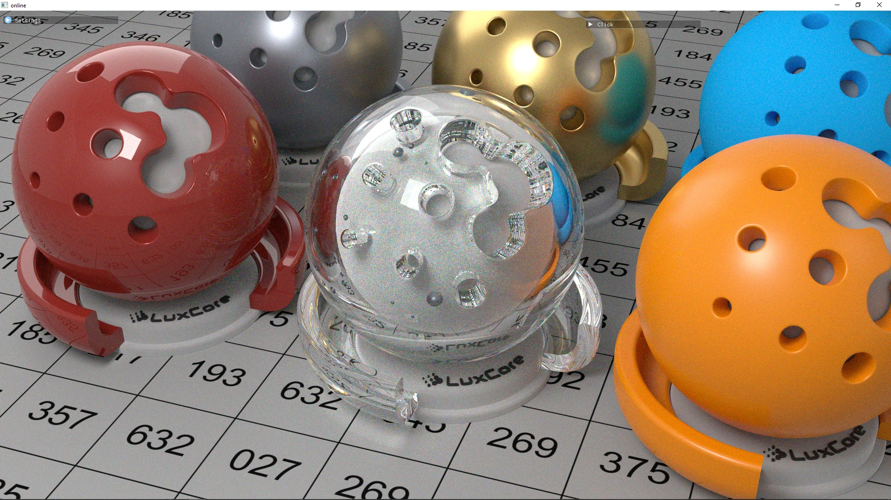

# Moonshine

**A spectral path tracer built with Zig + Vulkan**

*rendered by Moonshine* 
with Bounded VNDF Sampling for Smith-GGX Reflections

### Features
* Binaries
    * offline -- a headless offline renderer
    * online -- a real-time windowed renderer
    * hydra -- a hydra render delegate
* Light Transport
    * Full spectral path tracing
    * Direct light sampling with multiple importance sampling for all lights and materials
* Lights
    * 360° environment maps
    * Emissive meshes
* Materials
    * Standard PBR with metallic + roughness
    * Mirror
    * Glass with dispersion

### Dependencies
#### Build
* zig (see version [in CI](.github/workflows/build.yml))
* DirectXShaderCompiler
* For the online (real-time) renderer:
  * For Linux (Ubuntu, similar on others):
      * For Wayland: `wayland-protocols` `libwayland-dev` `libxkbcommon-dev`
      * For X11: `libxcursor-dev` `libxrandr-dev` `libxinerama-dev` `libxi-dev`
#### Run
* A GPU supporting Vulkan ray tracing

### // TODO
* Cameras
  * Orthographic
  * Fisheye
  * Lens System
* Materials
  * Conductor with complex IOR
  * Transmissive with roughness
  * Material composition
* Volumetrics
* Lights
  * Experiment with sampling triangle via solid angle after selecting it via area
  * Experiment with unifying sampling mesh lights and environment map
  * BVH
* Testing
  * Proper statistical tests GPU sampling routines
  * Proper statistical tests to make sure images have expected mean/variance
  * Should ensure validation layers are clean during tests
* Resource management
  * Make sure we have all necessary `errdefers`
  * Delayed-destruction resources should be attached to command buffer
  * GPU resource arrays should be resizable
  * Need some sort of way to do async resource creation (transfers, processing)
* Use physical (with correct scales) units
* Integrators
  * ReSTIR
* Spectral EXR output
* Tonemapping
* HDR display
  * A satisfying implementation is blocked by [HDR display metadata querying in Vulkan](https://github.com/KhronosGroup/Vulkan-Docs/issues/1787)

### Some notes about conventions
* `+z` is up
* phi is azimuthal angle (0-2pi) and theta is polar angle (0-pi)

### Some light reading
- [Importance sampling](https://computergraphics.stackexchange.com/q/4979)
- [Explicit light sampling](https://computergraphics.stackexchange.com/q/5152)
- [Multiple importance sampling](https://graphics.stanford.edu/courses/cs348b-03/papers/veach-chapter9.pdf)
- [Microfacets](https://agraphicsguy.wordpress.com/2015/11/01/sampling-microfacet-brdf/)
- [Actual materials](https://github.com/wdas/brdf) - ton of BRDF examples, in **CODE**!

### License

This project is licensed under the AGPL.
